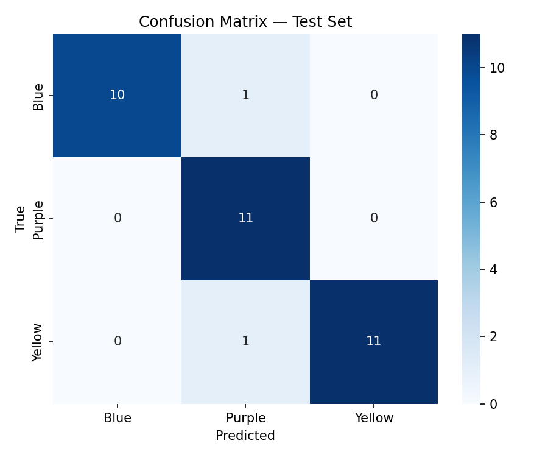
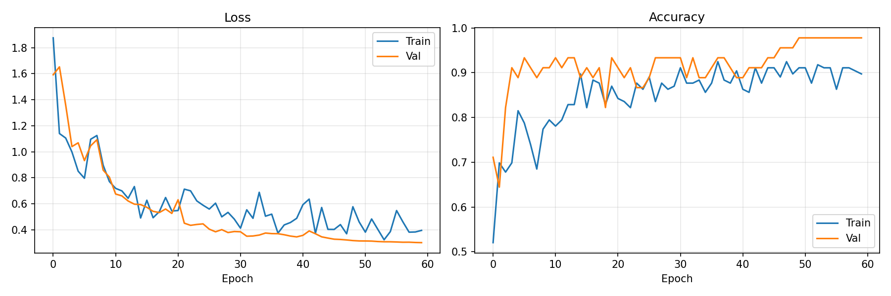

# Low-Shot Color Classifier

An end-to-end pipeline for **low-shot image classification**, designed to bridge the gap between manual data collection and deep learning. This project features a complete workflow: mobile data collection via AppSheet, an automated cleaning suite, a custom PyQt6 curation GUI, and a high-performance Convolutional Neural Network (CNN) built with TensorFlow/Keras.

---

## 🚀 Features

* **AppSheet Integration:** Seamlessly fetch image data and metadata collected from mobile devices using the AppSheet API.
* **Automated Pre-cleaning:** Scripts to automatically remove duplicate images (via SHA-256 hashing) and filter out low-resolution samples.
* **Interactive Curation:** A custom-built PyQt6 desktop application to manually review and select high-quality samples for the "low-shot" training set.
* **Cost-Sensitive CNN:** A specialized TensorFlow model that utilizes a custom loss function to penalize specific class confusions (e.g., Blue vs. Purple) more heavily.
* **Advanced Data Augmentation:** Custom layers for Saturation Jitter and Random Erasing to improve model robustness with minimal data.

---

## 📁 Project Structure

* `GetData.py`: Fetches metadata and downloads images from the AppSheet cloud.
* `CleanData.py`: Automated removal of duplicates and low-res images.
* `SelectImages.py`: PyQt6 GUI for manual image selection and labeling verification.
* `MoveFiles.py`: Utility to organize selected images into the final training directory.
* `CNN.ipynb`: The training pipeline, including data preprocessing (HSV conversion), model architecture, and evaluation.
* `Inference.py`: Predicts using the trained model.

---

## 🛠️ Installation & Setup

### 1. Prerequisites

> [!IMPORTANT]
>The script requires that [`uv`](https://pypi.org/project/uv/) and [`Microsoft Visual C++ Redistributable`](https://learn.microsoft.com/en-us/cpp/windows/latest-supported-vc-redist?view=msvc-170) be installed.
```bash
uv sync

```
>To run inference with the already trained model, proceed directly to **Step 6**, skipping all prior data processing and training steps.


### 2. Environment Variables

Create a `.env` file in the root directory to store your AppSheet credentials:

```env
APP_ID=your_appsheet_id
ACCESS_KEY=your_access_key
TABLE_NAME=your_table_name

```

---

## 🔄 Workflow Execution

Follow these steps in order to process your data and train the model:

### Step 1: Data Collection

Collect your color samples using your configured AppSheet app. Once ready, run the retrieval script:

```bash
uv run GetData.py

```

This downloads images to the `images/` folder and generates `metadata.csv`.

### Step 2: Automated Cleaning

Remove redundant or poor-quality files:

```bash
uv run CleanData.py

```

* **Duplicates:** Removed using SHA-256 hash comparison.
* **Resolution:** Defaults to removing images smaller than 150x150 pixels.

### Step 3: Manual Curation 

Launch the GUI to hand-pick the best representatives for each class:

```bash
uv run SelectImages.py

```

* **Controls:** Click images to toggle selection (Green = Keep, Red = Drop).
* **Output:** Saves your choices to `selected_images.csv`.

### Step 4: Finalize Dataset

Organize the selected files into the folder structure required by the model:

```bash
uv run MoveFiles.py

```

### Step 5: Training & Evaluation

Open `CNN.ipynb` in Jupyter or Google Colab. The notebook performs:

1. **Preprocessing:** Converts images to HSV color space to better isolate "Color" features.
2. **Training:** Executes a 3-block CNN with Global Average Pooling and Dropout.
3. **Cost-Sensitive Loss:** Uses a `COST_MATRIX` to specifically penalize confusion between Blue and Purple.
4. **ONNX Model Export:** Saves the trained model in ONNX format along with its configuration files and training results in the `output/` directory.

---

### Step 6: Inference

Runs an ONNX image classification pipeline that preprocesses an input image (RGB→HSV, resize, pad) and outputs the predicted class with confidence scores.

```bash
uv run Inference.py --image test.jpg --model_dir output

```


## 📊 Model Performance

The current architecture, **KHILONA_CNN**, achieves an overall accuracy of **94.12%**, even with small datasets (75 samples per class), by leveraging HSV color space and targeted augmentation.

### 🔍 Confusion Matrix


### 📈 Class-wise Performance
| Class | Precision | Recall | F1-Score |
| --- | --- | --- | --- |
| **Blue** | 1.00 | 0.91 | 0.95 |
| **Purple** | 0.84 | 1.00 | 0.91 |
| **Yellow** | 1.00 | 0.92 | 0.95 |

### 📉 Training History



